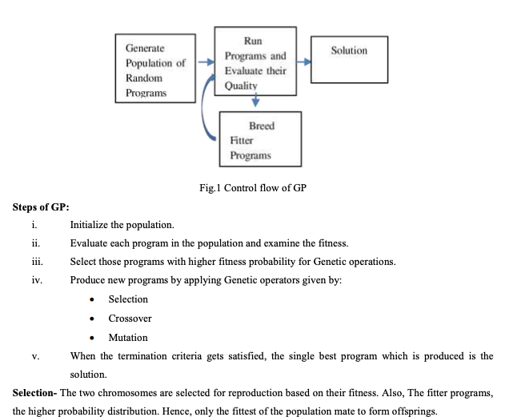
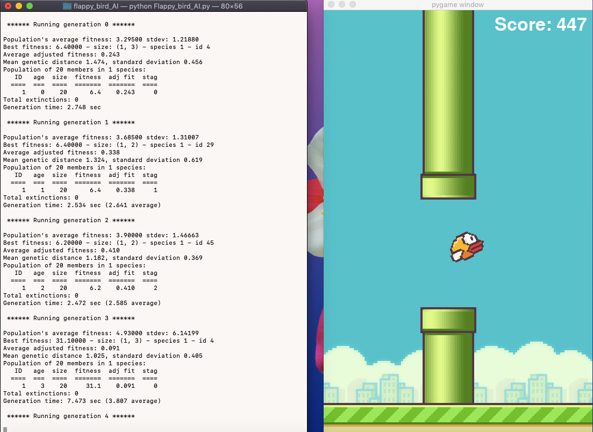

# Flappy-BIrd-AI
**Abstract:**

This project, apply neuroevolution on Flappy bird game, assisting bird to overcome obstacle. The use of NEAT-python 
(NeuroEvolution of Augmenting Topologies) library helped in applying genetic algorithm on Flappy Bird. The neural 
network involved in training the bird, evolve like genes evolve in human or other living creature in many generations. 
The change in generation can be made by use of Fitness function which can be used to reward the bird for its progress 
in the game. The Fitness function, reward bird in game environment, based on raw pixel value each frame the bird prowesses 
and help it to take right decision.

 **Working:**

Neuroevolution is a form artificial intelligence that uses concept of evolution and genetic algorithm. Inspired from biological evolution, evolutionary algorithm (EA) has 
mechanisms like reproduction, mutation, selection and recombination. The new generation mutation can be neutral, beneficial or  harmful. Also a new species will replace 
current species, if all the population of current species gets terminated This paper, uses NeuroEvolution of Augmenting Topologies (NEAT), a python library, which use  
evolutionary algorithm to form Artificial Neural Networks (ANN).

 

In computer science and operations research, a genetic algorithm (GA) is a metaheuristic inspired by the process of natural selection that belongs to the larger class 
of evolutionary algorithms (EA). Genetic algorithms are commonly used to generate high-quality solutions to optimization and search problems by relying on biologically 
inspired operators such as mutation, crossover and selection.

Fitness Calculation
To calculate the fitness of the bird (agent) 3 components are
used, called Scenario Fitness Components (SFC):  
• Traveled Distance: a counter that increases in each
interaction of the agent with the environment;  
• Score: the number of pairs of pipes already transposed;  
• Y Factor (ΔY ): the value obtained when the agent fails
on any part of the scenario, which is calculated by the
difference between the y coordinate of the agent and the
y coordinate of the midpoint of the passage between the
following pipes, defined as:  
ΔY = Yagent − Ypassage

